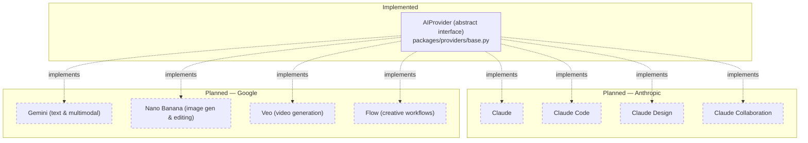
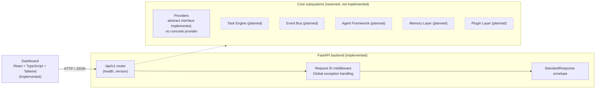

<div align="center">


# deRek AI OS

**An autonomous AI Operating System for coding, automation, creative generation, and intelligent task execution.**


[Vision](#vision) · [Core Principles](#core-principles) · [Roadmap](#roadmap) · [Documentation](#documentation) · [Contributing](#contributing)

</div>

---

## Table of Contents

1. [Project Description](#project-description)
2. [Current Status](#current-status)
3. [Vision](#vision)
4. [Core Principles](#core-principles)
5. [Why deRek?](#why-derek)
6. [Current Features](#current-features)
7. [Planned Features](#planned-features)
8. [AI Provider Strategy](#ai-provider-strategy)
9. [Future Integrations](#future-integrations)
10. [System Architecture](#system-architecture)
11. [Technology Stack](#technology-stack)
12. [Project Structure](#project-structure)
13. [Quick Start](#quick-start)
14. [Installation](#installation)
15. [Roadmap](#roadmap)
16. [Documentation](#documentation)
17. [Development Workflow](#development-workflow)
18. [Contributing](#contributing)
19. [Non-Goals](#non-goals)
20. [License](#license)
21. [Acknowledgements](#acknowledgements)

---

## Project Description

deRek AI OS is an open-source project building toward an autonomous operating layer for AI-driven work: coding, automation, creative generation, and intelligent task execution, coordinated through a single system rather than a collection of disconnected tools.

The project is in **early development**. The current release (`v0.1.0`) establishes the production-grade foundation — a versioned API, a structured logging and error-handling layer, and a minimal dashboard — that every future capability will be built on top of. No AI provider, agent, or automation capability is implemented yet.

## Current Status

| | |
|---|---|
| **Version** | `v0.1.0` |
| **Status** | Early Development |
| **Current phase** | Phase 0 — Foundation (see [Roadmap](#roadmap)) |

The foundational phase is complete: a versioned API, a standardized response envelope, structured logging, request correlation, global exception handling, a minimal dashboard, and an abstract AI provider interface. No AI provider, Task Engine, Event Bus, Memory Layer, Plugin Layer, or Agent Framework is implemented yet — see [Current Features](#current-features) and [Planned Features](#planned-features) for the full breakdown.

## Vision

deRek is designed around a common core: every capability of the system — AI providers, task execution, memory, plugins, and agents — plugs into that core through stable, well-defined interfaces. This core lives in `packages/kernel`. Rather than hard-wiring a specific model provider or automation tool into the application, deRek defines the contracts first (starting with an abstract AI provider interface) so that concrete integrations can be added, replaced, or run side by side without reshaping the system around them.

The long-term goal is a system that can be handed a task — write and ship code, generate and edit media, automate a workflow, research a topic — and reliably plan, execute, and report on it, using whichever AI providers and tools are appropriate for that task.

## Core Principles

These principles guide every architectural decision in the project, from the current foundation through everything planned on top of it. They are described in full detail in [`docs/PROJECT_BIBLE.md`](docs/PROJECT_BIBLE.md#4-core-principles); this is the short version.

- **Capability-first architecture.** The system is organized around what it can do — coding, reasoning, image generation, and so on — not around which vendor or model happens to do it.
- **Provider independence.** No subsystem depends on a specific AI vendor's SDK. All provider access goes through a single abstract interface, so providers can be added, swapped, or run in parallel without changes elsewhere in the system.
- **Production-ready engineering.** Every layer, however small, is built to production standards from the start — typed interfaces, structured logging, correlation IDs, consistent error handling, and test coverage.
- **Autonomous execution.** The system is designed to plan and carry out multi-step work with minimal supervision by default, while remaining observable and interruptible.
- **Extensible plugin ecosystem.** New capabilities and integrations are added by extending the system through defined extension points, not by modifying the core to special-case each addition.

## Why deRek?

Most AI tooling available today is either a single-model chat interface or a narrow, task-specific automation script. deRek is being built as the layer in between: a system that treats AI providers, task execution, memory, and automation as pluggable subsystems behind consistent interfaces, rather than as one-off integrations.

Three principles guide the project from this early stage:

- **Provider independence.** AI capabilities are defined behind an abstract interface first. Concrete providers (starting with Claude and Gemini) are implementations of that interface, not the interface itself.
- **Foundation before features.** Before any AI capability was added, the project established versioned APIs, a consistent response contract, structured logging, request correlation, and centralized error handling — the operational groundwork production systems need.
- **Transparency about status.** This README distinguishes explicitly between what is implemented today and what is planned. Nothing below is described as working unless it is.

## Current Features

Everything in this section is implemented in the current codebase.

- **Versioned REST API** — all endpoints are served under `/api/v1`.
- **Health and version endpoints** — `GET /api/v1/health` and `GET /api/v1/version` for liveness checks and deployment verification.
- **Standardized response envelope** — every API response (success or error) returns a consistent shape: `success`, `message`, `data`, `request_id`, `timestamp`.
- **Request correlation middleware** — every request is assigned a request ID (honoring a caller-supplied `X-Request-ID` header when present), propagated through logs, responses, and error handling.
- **Centralized exception handling** — unhandled exceptions, HTTP errors, and request validation failures are all caught, logged, and normalized into the standard response envelope with the correct HTTP status code.
- **Structured logging** — JSON-formatted logs for every incoming request, completed response, and exception, suitable for ingestion by any log aggregator.
- **Environment-based configuration** — all configuration is read from environment variables via `pydantic-settings`; no secrets are hardcoded in source.
- **Auto-generated API documentation** — Swagger UI (`/docs`), ReDoc (`/redoc`), and the raw OpenAPI schema (`/openapi.json`).
- **Minimal web dashboard** — a React, TypeScript, and Tailwind CSS single-page app that displays the application name, version, and live server status by polling the API.
- **Abstract AI provider interface** — `packages/providers/base.py` defines the `AIProvider` contract (request/response models, capability flags, error types) that all future provider integrations must implement. No concrete provider is implemented against it yet.
- **Reserved subsystem scaffolding** — `packages/kernel`, `packages/tasks`, `packages/events`, `packages/plugins`, `packages/agents`, `packages/memory`, and `packages/shared` exist as empty, structured packages reserved for the subsystems described in [Planned Features](#planned-features).
- **Automated test coverage** — a `pytest` suite covering the health and version endpoints, the response envelope contract, request ID propagation, and the global exception handler.
- **Replit deployment configuration** — `.replit`, `replit.nix`, and a run script for hosting the API on Replit.

## Planned Features

Everything in this section is **not yet implemented**. It represents the intended direction of the project, not current functionality.

- **Concrete AI provider integrations** — Claude and Gemini implementations of the `AIProvider` interface (see [AI Provider Strategy](#ai-provider-strategy)).
- **Task Engine** — scheduling and execution of discrete units of work across the system.
- **Event bus** (`packages/events`) — publish/subscribe communication between subsystems (tasks completing, providers responding, agents changing state).
- **Workers** — background and asynchronous execution processes separate from the request/response cycle.
- **Plugin system** (`packages/plugins`) — a defined extension mechanism for adding capabilities without modifying the core system.
- **Agent framework** (`packages/agents`) — autonomous, multi-step task planning and execution built on top of the Task Engine and provider layer.
- **Memory Layer** (`packages/memory`) — persistent state and context storage for tasks, agents, and providers.
- **Authentication and authorization** — not present in the current foundation.
- **Database connectivity** — no database is connected in the current release.
- **Mobile dashboard** — a mobile client, reserved at `apps/mobile`, not yet started.
- **Browser automation** and **email integration** — explicitly out of scope for the current foundation.

## AI Provider Strategy

The system defines its AI capabilities behind a single abstract interface rather than coupling directly to any provider's SDK. This interface is implemented today; the concrete providers are not. The full selection algorithm (capability matching, health checks, retries, fallback) is defined in [`docs/PROJECT_BIBLE.md`](docs/PROJECT_BIBLE.md#provider-selection-policy); the summary below covers what's implemented and what's planned.

**Implemented:**

- `AIProvider` (`packages/providers/base.py`) — an abstract base class every provider integration must implement, exposing `generate()`, `stream()`, and `health_check()`.
- Provider-agnostic request and response models (`ProviderRequest`, `ProviderResponse`, `ProviderMessage`, `ProviderUsage`) and a `ProviderCapability` flag set (text generation, streaming, vision, function calling, embeddings) that a given provider can declare support for.
- A dedicated error hierarchy (`ProviderError`, `ProviderUnavailableError`) so provider failures surface predictably regardless of the underlying vendor.

**Planned providers**, to be built as implementations of `AIProvider`:

| Provider | Capability | Purpose |
|---|---|---|
| Anthropic | Claude | General-purpose reasoning, writing, and conversation |
| Anthropic | Claude Code | Code generation, review, and software engineering assistance |
| Anthropic | Claude Design | AI-assisted visual and product design workflows |
| Anthropic | Claude Collaboration | Multi-agent and human-AI collaborative workflows |
| Google | Gemini (Text) | Text-based language understanding and generation |
| Google | Gemini (Multimodal) | Combined text, image, and other modality understanding and generation |
| Google | Nano Banana | Image generation and editing |
| Google | Veo | Video generation |
| Google | Flow | Creative workflow orchestration |



## Future Integrations

The planned Plugin Layer (`packages/plugins`) is designed to support integrations with external tools and services beyond AI providers, including:

- GitHub
- Slack
- Discord
- Notion
- Gmail
- Outlook
- Google Drive
- Google Calendar
- Docker
- AWS
- Local Files
- Browser Automation

None of these integrations are implemented in the current release. See [Plugin Strategy](docs/PROJECT_BIBLE.md#15-plugin-strategy) in `docs/PROJECT_BIBLE.md` for the contract each integration is expected to satisfy.

## System Architecture

The current architecture consists of an API and a dashboard, both implemented, in front of a set of reserved core subsystems, none of which are implemented yet.



## Technology Stack

| Layer | Technology | Status |
|---|---|---|
| Backend framework | FastAPI | Implemented |
| Backend language | Python 3.11 | Implemented |
| Data validation | Pydantic v2 | Implemented |
| Frontend framework | React | Implemented |
| Frontend language | TypeScript | Implemented |
| Frontend styling | Tailwind CSS | Implemented |
| Hosting | Replit | Implemented |
| Version control | GitHub | Implemented |
| AI provider — Anthropic | Claude, Claude Code, Claude Design, Claude Collaboration | Planned |
| AI provider — Google | Gemini, Nano Banana, Veo, Flow | Planned |
| Task execution | Task Engine, Workers | Planned |
| Messaging | Event Bus | Planned |
| Persistence | Memory Layer | Planned |
| Extensibility | Plugin Layer | Planned |
| Autonomy | Agent Framework | Planned |
| Mobile | Mobile Dashboard | Planned |

## Project Structure

```
apps/
  api/                  FastAPI backend
    main.py              Application factory, middleware and router wiring
    config.py             Environment-based settings
    logger.py             Structured JSON logging
    schemas.py             Standard API response envelope
    middleware.py           Request ID middleware
    exceptions.py            Global exception handlers
    routers/
      health.py              GET /api/v1/health
      version.py              GET /api/v1/version
      api.py                   Aggregates versioned routers
    tests/                  pytest suite
  dashboard/             React + TypeScript + Vite + Tailwind frontend
  mobile/                Reserved, not implemented

packages/
  kernel/                Reserved: shared core every capability plugs into
  providers/
    base.py                Abstract AIProvider interface (implemented)
  tasks/                 Reserved: task execution engine
  events/                Reserved: event bus
  plugins/               Reserved: plugin layer
  agents/                Reserved: agent framework
  memory/                Reserved: memory layer
  shared/                Reserved: cross-app shared types and utilities

docs/                   Documentation
tests/                  Cross-app / integration tests
tools/                  Developer tooling and scripts
infrastructure/         Deployment and infrastructure-as-code assets
```

## Quick Start

Requires Python 3.11 and Node.js 20+.

```bash
# Backend
cd apps/api
python3.11 -m venv .venv && source .venv/bin/activate
pip install -r requirements.txt
cp .env.example .env
python main.py
# API available at http://localhost:8000, docs at http://localhost:8000/docs

# Frontend (in a second terminal)
cd apps/dashboard
npm install
cp .env.example .env
npm run dev
# Dashboard available at http://localhost:5173
```

## Installation

### Prerequisites

- Python 3.11
- Node.js 20+ and npm
- A Replit account (optional, for hosted deployment)

### Backend

```bash
cd apps/api
python3.11 -m venv .venv
source .venv/bin/activate        # Windows: .venv\Scripts\activate
pip install -r requirements.txt
cp .env.example .env             # never commit a real .env file
python -m uvicorn main:app --reload --host 0.0.0.0 --port 8000
```

Verify the backend is running:

| Endpoint | URL |
|---|---|
| Root | `http://localhost:8000/` |
| Health | `http://localhost:8000/api/v1/health` |
| Version | `http://localhost:8000/api/v1/version` |
| Swagger UI | `http://localhost:8000/docs` |
| ReDoc | `http://localhost:8000/redoc` |

### Frontend

```bash
cd apps/dashboard
npm install
cp .env.example .env             # set VITE_API_BASE_URL if the API isn't on localhost:8000
npm run dev
```

### Running tests

```bash
cd apps/api
pytest
```

### Deployment (Replit)

The repository root includes `.replit`, `replit.nix`, and `tools_run_api.sh`. Running the project on Replit installs backend dependencies, seeds `.env` from `.env.example` if one does not already exist, and starts the API with `uvicorn` on the assigned port. The dashboard is a static Vite build (`npm run build`) and can be deployed separately, pointed at the deployed API's `/api/v1` prefix.

## Roadmap

| Phase | Focus | Status |
|---|---|---|
| Phase 0 | Foundation — versioned API, standard response envelope, structured logging, request correlation, global exception handling, dashboard skeleton, abstract AI provider interface | Complete |
| Phase 1 | Task Engine — task creation, the task lifecycle, execution modes, and capability-based routing | Planned |
| Phase 2 | Provider Implementations — concrete `AIProvider` implementations for Claude and Gemini, selected via the Provider Selection Policy | Planned |
| Phase 3 | Event Bus & Workers — publish/subscribe communication between subsystems and background execution | Planned |
| Phase 4 | Memory Layer — task, session, and long-term memory with durable storage | Planned |
| Phase 5 | Plugin Layer — the plugin contract, followed by the integrations listed in [Future Integrations](#future-integrations) | Planned |
| Phase 6 | Agent Framework — autonomous, multi-step planning and execution | Planned |
| Phase 7 | Expansion Surfaces — mobile client, browser automation, and the remaining creative-generation capabilities | Planned |

Phase boundaries and ordering may change as the project develops. This table mirrors the Long-Term Roadmap in [`docs/PROJECT_BIBLE.md`](docs/PROJECT_BIBLE.md#23-long-term-roadmap), which also explains why each phase depends on the ones before it.

## Documentation

This README is the project's concise, public-facing overview. Deeper documentation lives alongside it:

| Document | Purpose |
|---|---|
| [README.md](README.md) | This file — project overview, current status, setup, and public-facing summary. |
| [docs/PROJECT_BIBLE.md](docs/PROJECT_BIBLE.md) | The permanent architectural specification — vision, principles, provider strategy, task lifecycle, execution modes, security principles, and the full long-term roadmap. |
| [docs/architecture.md](docs/architecture.md) | A closer look at what's implemented today — the API layer, middleware, response envelope, and dashboard. |
| [Roadmap](#roadmap) | The phase-by-phase implementation plan above, kept consistent with the Long-Term Roadmap in `docs/PROJECT_BIBLE.md`. |

Where this README and `docs/PROJECT_BIBLE.md` overlap, `docs/PROJECT_BIBLE.md` is the source of truth; this README is kept aligned with it but stays intentionally shorter.

## Development Workflow

- Work from a feature branch off `main`; keep branches scoped to a single change.
- Run the backend test suite (`pytest`, from `apps/api`) before opening a pull request.
- Keep configuration in environment variables — never commit secrets or a real `.env` file.
- Match the structure and conventions of the module you're changing (for example, new endpoints follow the pattern in `apps/api/routers/`; new provider code should implement the `AIProvider` interface in `packages/providers/base.py` rather than bypass it).
- Prefer small, reviewable pull requests over large ones spanning multiple subsystems.
- Open an issue to discuss significant architectural changes before implementing them, given how early-stage the project is.

## Contributing

Contributions are welcome. Formal contribution guidelines are still being written; in the meantime:

1. Open an issue describing the change you'd like to make, especially for anything beyond a small fix.
2. Fork the repository and create a feature branch.
3. Make your change, following the conventions of the surrounding code.
4. Ensure the test suite passes locally.
5. Open a pull request with a clear description of the change and its motivation.

Given the project's early stage, expect interfaces — particularly the `AIProvider` contract and the `packages/kernel` layout — to evolve. Check open issues and recent pull requests before starting significant work to avoid duplication.

## Non-Goals

- **Not another chatbot.** deRek is not a conversational interface to a single model; its value is in task execution and orchestration, not chat.
- **Not a wrapper around one LLM.** deRek does not couple itself to a single AI vendor or model — see [Provider independence](#core-principles).
- **Not a low-code automation platform.** deRek is not a drag-and-drop workflow builder for non-technical users; it is an engineered system for autonomous, capability-driven task execution.
- **Not a collection of unrelated AI tools.** Every capability is expected to plug into the same core through the same contracts, not work standalone and disconnected from the rest of the system.

## License

A license has not yet been finalized and published for this project. Until a `LICENSE` file is added to the repository, all rights are reserved by the project maintainers. This section will be updated once a license is selected.

## Acknowledgements

deRek AI OS is built on top of, and would not be possible without, the open-source projects it depends on, including FastAPI, Pydantic, Starlette, Uvicorn, React, Vite, and Tailwind CSS.

AI capabilities are planned to build on models and tools from Anthropic and Google; deRek is an independent project and is not affiliated with either company.
