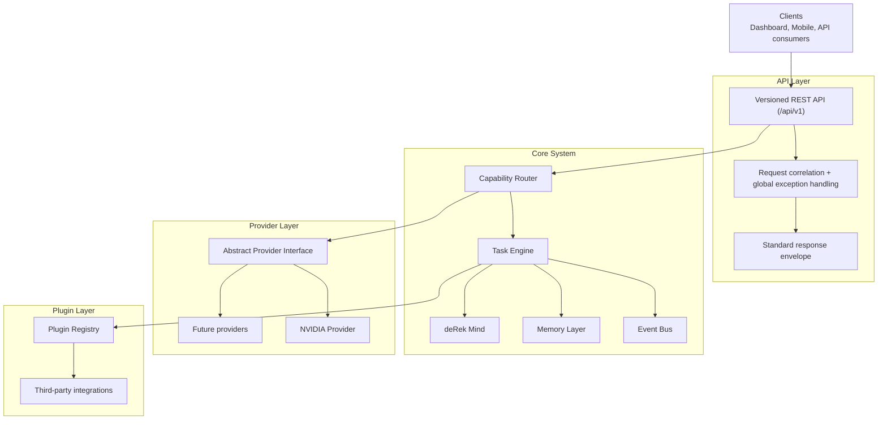
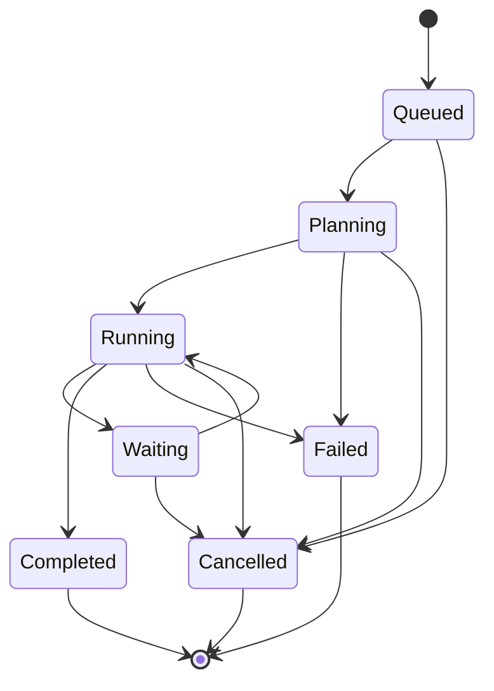

# deRek AI OS — Project Bible

**Status:** Living document. This is the permanent architectural specification for deRek AI OS. It defines what the system is, why it exists, how it is organized, and the standards every contribution to it is expected to follow.

**Scope note:** This document describes intent, principles, and structure. It does not describe features as implemented unless explicitly marked **Implemented**. Everywhere else, capabilities described here are **planned** — they define the target the codebase is being built toward, not its current state. See `README.md` for the current, versioned account of what is actually shipped.

---

## Table of Contents

1. [Vision](#1-vision)
2. [Mission](#2-mission)
3. [Product Philosophy](#3-product-philosophy)
4. [Core Principles](#4-core-principles)
5. [Architecture Overview](#5-architecture-overview)
6. [AI Provider Strategy](#6-ai-provider-strategy)
7. [Capability Router](#7-capability-router)
8. [Folder Structure](#8-folder-structure)
9. [Coding Standards](#9-coding-standards)
10. [Git Workflow](#10-git-workflow)
11. [Sprint Workflow](#11-sprint-workflow)
12. [Task Lifecycle](#12-task-lifecycle)
13. [deRek Mind / Agent Architecture](#13-derek-mind--agent-architecture)
14. [Execution Modes](#14-execution-modes)
15. [Memory Strategy](#15-memory-strategy)
16. [Plugin Strategy](#16-plugin-strategy)
17. [Architecture Decision Records (ADR)](#17-architecture-decision-records-adr)
18. [Documentation Standards](#18-documentation-standards)
19. [Security Principles](#19-security-principles)
20. [Testing Standards](#20-testing-standards)
21. [Naming Conventions](#21-naming-conventions)
22. [Future Integrations](#22-future-integrations)
23. [Non-Goals](#23-non-goals)
24. [Long-Term Roadmap](#24-long-term-roadmap)

---

## 1. Vision

deRek AI OS exists to be an operating layer for AI-driven work — a single system through which coding, automation, creative generation, research, and intelligent task execution are planned, executed, and reported on, rather than a growing pile of disconnected tools and one-off scripts stitched together by hand.

The system is organized around a common core that every capability plugs into through stable, well-defined interfaces. AI providers, task execution, memory, and plugins are not hard-wired into the application; they are implementations of contracts the system defines up front. That separation is what allows deRek to add, replace, or run capabilities side by side without reshaping the system every time a new provider, tool, or integration appears.

The long-term vision is a system that can be handed a task — write and ship code, generate or edit media, automate a workflow, research a topic, coordinate across several of these at once — and reliably plan it, execute it using whichever capability is appropriate, and report back on the outcome, with a human able to observe and intervene at any point.

## 2. Mission

To build a production-grade, provider-independent AI operating system, one properly engineered layer at a time — establishing the operational foundation (versioned APIs, structured logging, consistent error handling, request correlation) before any AI capability is added, and every AI capability behind an abstract interface before any concrete provider is wired in.

The project favors a system that is correctly layered and honestly documented over one that appears more capable than it is. Every section of this document distinguishes what is a durable architectural commitment from what is a stated intention still to be built.

## 3. Product Philosophy

- **The system is the product, not any single model.** deRek's value is the orchestration layer — task routing, provider abstraction, memory, and execution — not any particular AI model it happens to call. Models are interchangeable components underneath that layer.
- **Capabilities, not brand names.** Work is requested and routed by what needs to happen (`coding`, `image_generation`, `research`) and not by which vendor or model performs it. See [Capability Router](#7-capability-router).
- **Foundation before features.** Operational groundwork — versioning, logging, error handling, correlation IDs, configuration discipline — is built before the features that depend on it, not retrofitted afterward.
- **Explicit over implicit.** Status, scope, and intent are stated directly. A capability that does not exist yet is described as planned, not implied to exist through vague language.
- **Composable over monolithic.** Every subsystem (providers, tasks, events, memory, plugins, agents) is a distinct package with its own boundary, so it can be developed, tested, and reasoned about independently.

## 4. Core Principles

These principles govern architectural decisions across the project and take precedence over convenience or short-term speed when the two conflict.

- **Capability-first architecture.** The system is organized around what it can do (capabilities), not around which vendor or model happens to do it. Every capability is defined as a contract before any implementation is written against it.
- **Provider independence.** No subsystem depends on a specific AI vendor's SDK or API shape directly. All provider access goes through the abstract provider interface, so providers can be added, swapped, or run in parallel without changes elsewhere in the system.
- **Production-ready engineering.** Every layer — however small — is built to production standards from the start: typed interfaces, structured logging, correlation IDs, consistent error handling, and test coverage. There is no separate "prototype" tier of code that is expected to be rewritten later.
- **Autonomous execution.** The system is designed to plan and carry out multi-step work with minimal supervision by default, while remaining observable and interruptible — autonomy is a design goal, not a justification for opacity.
- **Extensible plugin ecosystem.** New capabilities, integrations, and tools are added by extending the system through defined extension points (providers, plugins, capability handlers), not by modifying the core to special-case each new addition.

## 5. Architecture Overview

deRek is organized in layers, each with a single responsibility, communicating through explicit contracts rather than direct coupling.



**API Layer.** The externally facing surface of the system: a versioned REST API, request correlation and global exception handling, and a standard response envelope applied consistently across every endpoint.

**Core System.** The Capability Router, Task Engine, Event Bus, Memory layer, and deRek Mind. This is the system's central coordination logic — it decides what needs to happen, tracks the state of work in progress, and holds the context that work depends on.

**Provider Layer.** All AI capability is accessed through a single abstract provider interface. Concrete providers (NVIDIA and others as they are added) are implementations of that interface and are interchangeable from the Core System's point of view.

**Plugin Layer.** External services and tools (GitHub, Slack, Docker, browser automation, and so on) are integrated as plugins registered against defined extension points, rather than being called directly from Core System code.

Each layer depends only on the contract exposed by the layer below it, not on that layer's implementation details. This is what allows any layer to evolve — a new provider, a new plugin, a new storage backend for memory — without requiring changes to the layers around it.

## 6. AI Provider Strategy

deRek's active AI provider strategy is **NVIDIA-first**. All current runtime model access goes through a single NVIDIA provider implementation against the abstract `AIProvider` interface. The Core System calls "generate a response" without knowing or caring which model is behind it; the provider layer resolves the chosen model into a concrete call.

This interface (`AIProvider`) defines, at minimum:

- A method to generate a complete response for a request.
- A method to stream a response incrementally.
- A health check the system can use to determine whether a provider is currently available.
- A declared set of capabilities (for example: text generation, streaming, vision, function calling, embeddings) so the Capability Router can select an appropriate provider for a given request.
- A dedicated error hierarchy, so provider failures are predictable and handled uniformly regardless of the underlying vendor's own error format.

### Runtime model lineup (NVIDIA)

The active deRek runtime is built around the NVIDIA Nemotron model family, exposed through the **NVIDIA Provider**. The current model lineup is:

| Model | Role | Intended use |
|---|---|---|
| **Nemotron 3.5 Lightning** | Quick / fast model | Low-latency responses, simple tasks, high-frequency agent steps, lightweight execution and validation |
| **Nemotron 3 Super** | Balanced / default agent model | Coding, reasoning, planning, tool use, RAG-oriented workloads, normal autonomous tasks |
| **Nemotron 3 Ultra** | Maximum reasoning model | Complex planning, difficult coding, complex multi-step agent tasks, high-complexity reasoning |

In addition, **Nemotron Embed** is the planned retrieval / embedding model intended for the future Memory + RAG layer (see [Memory Strategy](#15-memory-strategy) and [Long-Term Roadmap](#24-long-term-roadmap)). Nemotron Embed is **not** part of the current Task Engine implementation.

### Runtime architecture

At runtime, the provider chain is conceptually:

```
User
  ↓
Model Selector
  ↓
Auto OR User-selected model
  ↓
NVIDIA Provider
  ↓
NVIDIA API
  ↓
Nemotron model
```

The **Model Selector** is the abstraction point between the Core System and any concrete model. The Task Engine does not directly depend on a specific model; it depends on the Model Selector, which in turn delegates to the NVIDIA Provider for the current Nemotron lineup. Adding a new model or provider in the future only requires extending the Model Selector and provider interface — the Task Engine itself does not need to be rewritten.

The NVIDIA Provider is documented as **NVIDIA hosted / API access**, subject to NVIDIA's current availability, quotas, rate limits, and terms. deRek must handle gracefully:

- rate limits,
- provider unavailability,
- API errors,
- and changes in model availability.

deRek does not hard-code assumptions about permanently free API access.

### User model selection

Model selection is a first-class deRek feature. The user is expected to be able to choose:

- **Auto** — deRek selects the appropriate model based on task complexity and capability.
- **Nemotron 3.5 Lightning** — manual override for quick / fast execution.
- **Nemotron 3 Super** — manual override for balanced default workloads.
- **Nemotron 3 Ultra** — manual override for maximum reasoning.

Auto mode allows deRek to select the appropriate model based on task complexity and capability. Manual mode allows the user to explicitly select the model. The current selection is communicated to the NVIDIA Provider by the Model Selector and resolved into a concrete Nemotron model call.

Model selection is **not** hard-coded into the Task Engine. The architecture uses a model abstraction, a model registry, and a provider interface so additional models can be added later without rewriting the Task Engine.

### Providers

| Provider | Status | Models |
|---|---|---|
| NVIDIA | Active runtime provider | Nemotron 3.5 Lightning, Nemotron 3 Super, Nemotron 3 Ultra (current); Nemotron Embed (planned for Memory + RAG) |

Additional providers beyond NVIDIA may be added later using the same abstract interface, without requiring changes to how the Core System consumes providers. No concrete provider other than what is described here is part of the current architecture.

> **Note on external development tools.** Claude Code may be used by the development team as an external development and coding tool for building deRek. Claude Code is **not** a deRek runtime provider — it is an internal development aid, separate from the production runtime architecture described above.

### Provider Selection Policy

When the Capability Router resolves a task to a provider, it is expected to follow a fixed, deterministic selection algorithm rather than an ad hoc or arbitrary choice. The algorithm proceeds in the following order:

1. **Match requested capability.** Identify the set of providers that declare support for the capability the task requires.
2. **Apply model selection mode.** If Auto mode is active, the Model Selector chooses the appropriate model based on capability and complexity. If manual mode is active, the user-selected model takes precedence.
3. **Prefer configured default provider / model.** Within the matched set, prefer the provider configured as the default for the capability, if one is set.
4. **Verify provider health.** Confirm the selected provider currently reports healthy via its health check before routing the task to it.
5. **Route task.** Dispatch the task to the selected provider.
6. **Retry if transient failure.** If the provider call fails with a transient error (rate limit, network error, API error), retry according to the system's standard retry policy before treating the attempt as failed.
7. **Use fallback provider if available.** If retries are exhausted or the provider is unhealthy, fall back to the next eligible provider for the same capability, if one is configured.
8. **Log provider selection.** Record which provider was selected, why, and the outcome of the attempt, so provider selection is auditable after the fact.
9. **Return standardized result.** Return the result to the caller through the same `ProviderResponse` shape regardless of which provider ultimately served the request.

Provider selection must remain deterministic and capability-driven at every step of this algorithm. Given the same capability, the same configuration, and the same provider health state, the router is expected to make the same selection every time — selection is never randomized and never depends on anything other than declared capability, configuration, and health.

## 7. Capability Router

The Capability Router is the component responsible for a specific architectural rule: **the Task Engine routes work by capability, not by model name.**

When a task is created, it declares what needs to happen — a capability — not which model or vendor should do it. The Capability Router resolves that capability to an available provider (or plugin) that declares support for it, at execution time. This keeps task definitions, task history, and any code that creates tasks completely decoupled from which specific model or vendor happens to be serving a given capability today.

With the NVIDIA Provider as the active runtime provider, the Capability Router resolves capabilities to a model within the Nemotron lineup through the Model Selector. In Auto mode, the Model Selector chooses the appropriate Nemotron model based on the task's declared capability and complexity. In manual mode, the user's explicit model choice takes precedence.

Representative capabilities the router is expected to handle:

- `coding`
- `reasoning`
- `lightweight_execution`
- `tool_use`
- `rag_retrieval`
- `browser_automation`
- `email`
- `research`

This list is representative, not exhaustive — new capabilities are added as new providers are integrated. A task that requests `coding` should behave identically regardless of whether it is ultimately served by Nemotron 3 Super, a future coding-capable provider, or a locally hosted model, provided that provider declares support for the `coding` capability. Swapping the provider behind a capability must never require changing the tasks or code that request it.

## 8. Folder Structure

```
apps/
  api/                    FastAPI backend — the system's API layer.
    main.py                 Application factory: builds the FastAPI app, wires
                             middleware and routers, defines startup/shutdown.
    config.py                Environment-variable-based settings. No secrets
                             in source; all configuration is externalized.
    logger.py                 Structured JSON logging configuration.
    schemas.py                 The standard API response envelope
                             (success, message, data, request_id, timestamp).
    middleware.py               Request correlation (request ID) middleware.
    exceptions.py                 Global exception handlers — unhandled
                             exceptions, HTTP errors, and validation errors
                             are all normalized to the standard envelope.
    routers/                Versioned route handlers, aggregated under /api/v1.
    tests/                   Automated test suite for this app.

  dashboard/               React + TypeScript + Tailwind CSS frontend. The
                            reference client for the API layer.

  mobile/                 Reserved for a future mobile client. Not started.

packages/
  kernel/                 Reserved for the system's shared core wiring —
                          the layer that connects providers, tasks, events,
                          memory, and plugins together. Empty; not implemented.

  providers/              The AI Provider Layer.
    base.py                 The abstract AIProvider interface — implemented.
                            No concrete provider (NVIDIA or otherwise)
                            is implemented here yet.

  tasks/                  Reserved for the Task Engine — task definitions,
                          scheduling, and execution. Empty; not implemented.

  events/                 Reserved for the Event Bus — publish/subscribe
                          communication between subsystems. Empty; not
                          implemented.

  plugins/                Reserved for the Plugin Layer — the registry and
                          contract for third-party integrations. Empty; not
                          implemented.

  agents/                 Reserved for the deRek Mind — autonomous,
                          multi-step task planning and execution built on
                          top of the Task Engine and Provider Layer. Empty;
                          not implemented.

  memory/                 Reserved for the Memory Layer — persistent state
                          and context storage for tasks, agents, and
                          providers. Empty; not implemented.

  shared/                 Reserved for cross-app shared types and utilities
                          used by more than one app or package. Empty; not
                          implemented.

docs/                    Project documentation, including this document and
                          the architecture overview.

tests/                   Cross-app and integration tests that span more than
                         one app or package.

tools/                   Developer tooling and scripts.

infrastructure/          Deployment and infrastructure-as-code assets beyond
                         what's needed to run the project locally.
```

Every folder under `packages/` exists to fix the shape of the system now, even where its contents are empty. New code belongs in the package whose responsibility matches it; a package should not accumulate responsibilities that belong to a sibling package.

## 9. Coding Standards

- **Python.** Target the latest stable Python release. All public functions, methods, and class attributes are typed. Pydantic v2 models are used for any structured data crossing a boundary (API requests/responses, provider requests/responses, configuration). Prefer explicit, readable code over clever code.
- **TypeScript.** Strict mode is enabled and stays enabled. No `any` without a documented reason. Components are function components using hooks; shared logic is extracted rather than duplicated across components.
- **No hardcoded configuration.** Configuration and secrets are read from environment variables only, via the project's settings layer. Nothing environment-specific is committed to source.
- **No silent failure.** Errors are raised or logged with context, never swallowed. Provider and plugin code raises the project's own error types rather than leaking vendor-specific exceptions upward.
- **Consistency over local preference.** New code follows the conventions already established in the module or package it's added to. Introducing a new pattern is a deliberate decision, discussed before it's adopted project-wide.
- **Small, single-responsibility units.** Functions, modules, and packages each do one thing. A module that is accumulating unrelated responsibilities is a signal to split it.
- **Comments explain why, not what.** Code should be readable enough that comments are unnecessary to describe what it does; comments are reserved for intent, trade-offs, and constraints that aren't obvious from the code itself.

## 10. Git Workflow

- `main` is always deployable. Nothing broken is merged into it.
- Work happens on feature branches cut from `main`, scoped to a single change or a single sprint task.
- Branch names describe the change (for example, a short, hyphenated description of the task), not just a ticket number.
- Commits are scoped and descriptive; a commit message should let a reviewer understand the change without opening the diff.
- Pull requests describe what changed and why, reference the relevant sprint task or issue, and call out anything a reviewer should pay particular attention to.
- The automated test suite must pass locally before a pull request is opened, and in CI before it is merged.
- Significant architectural changes — anything that touches this document's contents — are discussed in an issue before implementation begins, not proposed for the first time in a pull request.
- Squash or rebase merges are preferred to keep `main`'s history readable; merge commits that bundle unrelated changes are avoided.

## 11. Sprint Workflow

deRek is developed in sprints, each scoped to a specific, boundaried set of changes rather than an open-ended feature.

1. **Scope.** A sprint begins with a clear, written scope: what will change, and — explicitly — what will not. Scope creep during a sprint is resolved by deferring the extra work to a future sprint, not by silently expanding the current one.
2. **Plan.** The affected packages, files, and interfaces are identified before implementation starts. Where a sprint touches an existing contract (for example, the provider interface or the response envelope), the impact on existing callers is assessed up front.
3. **Implement.** Changes are made against the agreed scope. Existing architecture, folder structure, and conventions are respected unless the sprint's explicit purpose is to change them.
4. **Verify.** Automated tests are updated and run. Any manual verification steps relevant to the sprint are documented so they can be repeated.
5. **Document.** Documentation affected by the sprint (this document, the README, architecture notes) is updated in the same sprint as the code change, not deferred to a later one.
6. **Close.** The sprint's changes are summarized — what was implemented, what was explicitly deferred, and what, if anything, changed about the plan during implementation.

## 12. Task Lifecycle

Every unit of work executed by the Task Engine moves through a defined set of states. A task is always in exactly one state, and every transition is expected to be recorded so a task's history can be reconstructed.

| State | Meaning |
|---|---|
| **Queued** | The task has been created and is waiting to be picked up for planning or execution. |
| **Planning** | The task is being decomposed into an execution plan — which capability, which provider or plugin, and in what order, if it involves multiple steps. |
| **Running** | The task's plan is actively being executed. |
| **Waiting** | Execution is paused pending an external condition — a dependency, a rate limit, or explicit human input or approval. |
| **Completed** | Execution finished successfully and the task's result is available. |
| **Failed** | Execution could not complete successfully. The failure reason is recorded against the task. |
| **Cancelled** | The task was stopped before completion, either by a human or by the system, without being counted as a failure. |



A task's transition history is part of its record — the system does not overwrite prior state, it appends to it. This is what allows a human to inspect not just a task's current status, but how it got there.

## 13. deRek Mind / Agent Architecture

The deRek Mind is the autonomous agent architecture that sits above the Task Engine. It is responsible for turning a user's intent into a sequence of tool-using, goal-directed actions — planning, executing, observing, evaluating, and revising until the task is complete. The architecture is owned by deRek, not by any model vendor: deRek provides the agent loop, the tools, the memory, and the execution discipline. The model provides the reasoning capability underneath that loop.

```
User
 ↓
Task Engine
 ↓
deRek Mind
 ↓
Planner
 ↓
Tool Executor
 ↓
Observation
 ↓
Evaluation / Critic
 ↓
Retry / Revision
 ↓
Verification
 ↓
Completion
```

This is the intended flow:

1. **User** submits a task.
2. **Task Engine** receives it and enters it into the task lifecycle (see [Task Lifecycle](#12-task-lifecycle)).
3. **deRek Mind** takes over once planning begins — it owns the agentic loop from this point forward.
4. **Planner** decomposes the task into a sequence of executable steps.
5. **Tool Executor** carries out each step, calling the appropriate capability (provider, plugin, or internal action).
6. **Observation** captures the result of each step.
7. **Evaluation / Critic** assesses whether the result meets the step's intent and the overall task goal.
8. **Retry / Revision** revises the plan and retries if the result is insufficient — the agent loop continues until the task succeeds or is explicitly cancelled.
9. **Verification** confirms the final result against the original task intent.
10. **Completion** marks the task as completed in the Task Engine.

### Model vs. deRek: a critical distinction

It is important not to describe deRek as merely a wrapper around an AI API. The relationship is:

- **The model** (Nemotron 3 Super or Ultra via the NVIDIA Provider) is the reasoning engine. It processes prompts, generates text, reasons about plans, and critiques outputs.
- **deRek** is the agent architecture: task management, planning, tool execution, observation, evaluation, retry/revision, verification, and the overall execution discipline that turns a model's reasoning into completed work.

The model is a component; deRek is the system that uses it. deRek's identity is not tied to any specific model — the provider interface exists precisely so that the model can be changed without changing deRek itself.

This distinction is what makes deRek an operating system rather than a thin API client. The agentic loop — planning, executing, observing, evaluating, retrying, verifying — is deRek's contribution. The model's contribution is reasoning within that loop.

The deRek Mind and the full agent architecture are **not** implemented in the current sprint. They are part of the planned system, following the Task Engine in the roadmap (see [Long-Term Roadmap](#24-long-term-roadmap)).

## 14. Execution Modes

A task's lifecycle (see [Task Lifecycle](#12-task-lifecycle)) describes the states a task moves through. Execution mode describes something different: what causes a task to be created and run in the first place, and how closely a human is involved while it does. Every task runs under exactly one execution mode.

- **Interactive.** The task is created and driven directly by a human, in real time, typically through a conversational or request/response interaction. The system executes and reports back within the interaction itself, and the human is present to review the result as it completes.
- **Background.** The task runs outside the immediate request/response cycle. It is created by an interactive request (or another task) but does not block on completion — the requester continues, and the task's result is delivered or retrieved separately once it finishes.
- **Scheduled.** The task is created to run at a specific time or on a recurring interval, independent of any single interactive request. Scheduling defines when the task enters the `Queued` state; from there it follows the same lifecycle as any other task.
- **Event Driven.** The task is created in response to an event published on the Event Bus (see [Architecture Overview](#5-architecture-overview) and the Event Bus phase in [Long-Term Roadmap](#24-long-term-roadmap)), rather than by direct human request or a schedule. This is what allows one subsystem's outcome to trigger work in another without those subsystems being directly coupled.
- **Autonomous.** The task, or a chain of tasks, is planned and carried out by the deRek Mind with minimal step-by-step human direction, consistent with the autonomous execution principle in [Core Principles](#4-core-principles). Autonomous mode still produces the same observable task records and remains interruptible; autonomy governs how a task is initiated and directed, not whether it is observable.

Execution mode and task lifecycle are independent of each other: a task in any of these modes still moves through `Queued`, `Planning`, `Running`, `Waiting`, `Completed`, `Failed`, or `Cancelled` in the same way. Execution mode determines how and why a task begins; the lifecycle governs it from that point forward.

## 15. Memory Strategy

Memory is the persistent state and context layer that tasks, agents, and providers draw on across executions — it is what allows the system to act on more than the contents of a single request.

At a strategic level, deRek's memory layer is expected to distinguish between:

- **Task memory** — context specific to a single task's execution (its inputs, intermediate results, and outputs), scoped to that task's lifetime and history.
- **Session or working memory** — shorter-lived context relevant to an ongoing interaction or a sequence of related tasks.
- **Long-term memory** — durable context that persists across sessions and tasks (for example, established facts, preferences, or prior outcomes worth retaining), retrieved deliberately rather than always loaded in full.

The memory layer is accessed through its own interface, in the same spirit as the provider layer: consumers (the Task Engine, the deRek Mind) depend on a memory contract, not on a specific storage backend, so the underlying storage technology can be chosen or changed without reshaping the code that depends on it.

Memory is not implemented in the current codebase (`packages/memory` is a reserved, empty package). This section defines the strategy the eventual implementation is expected to follow.

### Memory + RAG (Planned)

The planned Memory + RAG subsystem integrates persistent memory with retrieval-augmented generation. The planned architecture is:

```
Memory Layer
  ↓
Hybrid Retrieval
  ├── Semantic/vector retrieval
  ├── Keyword/exact retrieval
  └── Structured memory
  ↓
Reranking
  ↓
Context Builder
  ↓
deRek Mind
```

**Nemotron Embed** is the planned retrieval/embedding model for the future Memory + RAG layer. It is intended for the retrieval/embedding pipeline and is **not** part of the current Task Engine implementation. When the Memory Layer is implemented (per the Long-Term Roadmap), Nemotron Embed will provide the vector embedding capability for semantic retrieval, complementing keyword-based retrieval and structured memory access.

RAG is a **planned** subsystem, not an implemented feature. No RAG, retrieval, or memory implementation exists in the current codebase.

## 16. Plugin Strategy

Plugins are how deRek integrates with external tools and services (see [Future Integrations](#21-future-integrations)) without those integrations being written directly into the Core System.

A plugin is expected to:

- Declare the capability or capabilities it provides, in the same terms the Capability Router uses elsewhere in the system.
- Implement a defined plugin interface rather than being called through ad hoc, integration-specific code paths.
- Be independently registrable and removable — the Core System should function with a given plugin absent, degrading the capabilities that plugin provided rather than failing outright.
- Own its own configuration and credentials, read through the project's standard environment-variable-based configuration approach — never hardcoded.
- Fail predictably: a plugin's errors are caught and surfaced through the system's standard error handling, not allowed to propagate as unhandled exceptions.

The plugin system itself is not implemented in the current codebase (`packages/plugins` is a reserved, empty package). This section defines the contract the eventual implementation is expected to satisfy.

## 17. Architecture Decision Records (ADR)

Major architectural decisions — the kind that would change how a reader of this document understands the system if reversed — are recorded as Architecture Decision Records in `docs/adr/`, not left to live only in pull request discussions or chat history.

- Any decision that changes a core dependency, a system boundary, a contract another package depends on, or a principle stated elsewhere in this document is recorded as an ADR before or alongside the change that implements it.
- ADRs preserve historical decisions. An ADR is a record of what was decided, when, and why, given the information available at the time — it is a permanent part of the project's history, not a draft to be tidied up later.
- Existing ADRs are never rewritten. If a past decision is revisited and changed, the original ADR is left exactly as it was, and a new ADR is written that explicitly supersedes it, linking back to the one it replaces. This is what allows a reader to reconstruct not just the current decision, but the sequence of decisions that led to it.
- Representative examples of decisions expected to warrant an ADR:
  - Why FastAPI
  - Why Provider Layer
  - Why Capability Router
  - Why Supabase

## 18. Documentation Standards

- Documentation is updated in the same change as the code it describes, not treated as a follow-up task.
- Every document states its own status where relevant — current and implemented, or planned/aspirational — so a reader is never left to guess whether something described actually exists yet.
- The README is the project's public-facing, versioned account of current state. This document (the Project Bible) is the durable architectural specification. Where the two would otherwise disagree, the actual codebase is the source of truth, and both documents are corrected to match it.
- Diagrams (Mermaid, where used) are kept in sync with the architecture they describe; a diagram that no longer matches the system is worse than no diagram.
- Documentation is written in plain, direct language. Marketing language and unverified superlatives are avoided in favor of specific, checkable claims.
- New reserved or empty packages are documented with a short `README.md` explaining what they are reserved for, so their purpose is clear before any implementation exists.

## 19. Security Principles

- **Principle of Least Privilege.** Every component, provider, and plugin is granted only the access it needs to do its job, and no more. Broad or standing access is avoided in favor of narrowly scoped permissions granted per capability.
- **Environment variables for secrets.** All secrets — API keys, tokens, credentials — are read from environment variables through the project's standard configuration layer, never embedded in code or configuration files.
- **Never commit API keys.** No API key, token, or credential is ever committed to the repository, in source, in configuration, or in example files. Example environment files document the required variable names only, never real values.
- **Encryption for sensitive data.** Sensitive data is encrypted both in transit and at rest wherever it is stored or transmitted by the system.
- **Audit logging for privileged operations.** Any operation with elevated consequence — provider credential use, plugin actions against external systems, destructive actions — is logged with enough context (what, when, by which task, under which execution mode) to reconstruct after the fact what happened and why.
- **Human approval for destructive actions.** Actions that are destructive or difficult to reverse require explicit human approval before execution, regardless of whether the task driving them is running in an autonomous execution mode.
- **Secure provider authentication.** Authentication to AI providers is handled through the provider layer's own configuration, using credentials scoped to that provider only, never shared across providers or hardcoded into provider implementations.
- **Secure plugin permissions.** Plugins declare the permissions they require, consistent with the plugin contract in [Plugin Strategy](#15-plugin-strategy), and are granted only those permissions — a plugin should not be able to silently gain access beyond what it declared it needs.

## 20. Testing Standards

- Every package or app that contains logic has an automated test suite; a package with no tests is treated as incomplete, not merely untested.
- Tests are written against public interfaces and observable behavior, not internal implementation details, so implementations can change without needlessly breaking tests.
- The API layer's response envelope, error handling, and request correlation behavior are covered by tests, since every endpoint depends on them.
- Provider implementations are tested against the `AIProvider` interface's contract (using fakes or mocks for the underlying vendor calls), so a provider's conformance to the interface can be verified without depending on a live external service in the standard test run.
- Tests must pass locally before a pull request is opened, and in CI before a pull request is merged.
- A bug fix is accompanied by a test that would have caught the bug, wherever practical.

## 21. Naming Conventions

- **Packages and folders:** lowercase, hyphen-free, singular-or-plural as appropriate to their contents (`providers`, `tasks`, `events`) — chosen for what they contain, matching the existing `packages/` layout.
- **Python modules and files:** `snake_case.py`.
- **Python classes:** `PascalCase` (for example, `AIProvider`, `StandardResponse`).
- **Python functions and variables:** `snake_case`.
- **TypeScript/React components:** `PascalCase` filenames matching the component name (for example, `ServerStatus.tsx`).
- **TypeScript functions and variables:** `camelCase`.
- **Capabilities** (as used by the Capability Router): lowercase, `snake_case` identifiers (for example, `image_generation`, `browser_automation`), matching the list in [Capability Router](#7-capability-router).
- **Environment variables:** `UPPER_SNAKE_CASE`, matching the existing convention in `config.py` and every `.env.example` file.
- **API routes:** lowercase, hyphenated where multi-word, versioned under `/api/v{n}`.
- **Task states:** `PascalCase` as listed in [Task Lifecycle](#12-task-lifecycle) (`Queued`, `Planning`, `Running`, `Waiting`, `Completed`, `Failed`, `Cancelled`).

## 22. Future Integrations

The plugin system is expected to support integrations with the following external tools and services. None of these are implemented in the current codebase; they are listed here to establish the intended integration surface the Plugin Layer is designed against.

- GitHub
- Slack
- Discord
- Notion
- Gmail
- Outlook
- Google Drive
- Google Calendar
- Docker
- AWS
- Local Files
- Browser Automation

Each of these, when implemented, is expected to be a plugin in the sense defined in [Plugin Strategy](#15-plugin-strategy) — declaring the capabilities it provides, independently registrable, and failing predictably through the system's standard error handling.

## 23. Non-Goals

Stating what deRek is not is as important as stating what it is. These are deliberate exclusions, not gaps to be closed later:

- **Not another chatbot.** deRek is not a conversational interface to a single model. Conversation may be one surface of the system, but the system's value is in task execution and orchestration, not chat.
- **Not a wrapper around one LLM.** deRek does not couple itself to a single AI vendor or model. The provider interface exists specifically so that no part of the system's identity depends on which model is behind it.
- **Not a low-code automation platform.** deRek is not a drag-and-drop workflow builder aimed at non-technical users configuring simple triggers and actions. It is an engineered system for autonomous, capability-driven task execution.
- **Not a collection of unrelated AI tools.** Every capability in deRek is expected to plug into the same core through the same contracts. A feature that only works standalone, disconnected from the Capability Router, the Task Engine, and the rest of the system, does not belong in deRek as currently scoped.

## 24. Long-Term Roadmap

This roadmap describes the intended order of major architectural phases. It is not a committed schedule, and phase boundaries may shift as the project develops.

| Sprint | Focus | Status |
|---|---|---|
| Sprint 1 | Foundation — versioned API, standard response envelope, structured logging, request correlation, global exception handling, dashboard skeleton, and the abstract AI provider interface | **Completed** |
| Sprint 2.1 | Runtime Modernization — make the backend compatible with the latest stable Python release (currently Python 3.14), keeping the project maintainable for future Python releases | **Current prerequisite work** |
| Sprint 2 | Task Engine — task creation, the state transitions defined in [Task Lifecycle](#12-task-lifecycle), the execution modes defined in [Execution Modes](#14-execution-modes), and capability-based routing as described in [Capability Router](#7-capability-router) | **Completed** |
| Sprint 3 | deRek Mind + NVIDIA Model Integration — the deRek Mind agent architecture described in [deRek Mind / Agent Architecture](#13-derek-mind--agent-architecture), wired to the NVIDIA Provider and the Nemotron model lineup defined in [AI Provider Strategy](#6-ai-provider-strategy) | **Planned** |
| Sprint 4 | Memory + RAG — implementation of the strategy defined in [Memory Strategy](#15-memory-strategy), including the planned Memory + RAG subsystem (Hybrid Retrieval, Reranking, Context Builder) and the Nemotron Embed retrieval/embedding model | **Planned** |
| Sprint 5+ | Tool Expansion / Autonomous Workflows / Additional Capabilities — the Plugin Layer, additional integrations, expanded autonomous agent capabilities, and other surfaces | **Planned** |

Phase boundaries and ordering may change as the project develops. Each sprint is expected to be built on a stable version of the sprints before it — Sprint 2's Task Engine work is not built ahead of Sprint 1's Foundation being solid, Sprint 3's deRek Mind work is not built ahead of Sprint 2's Task Engine that it depends on, and Sprint 4's Memory + RAG work is not built ahead of the deRek Mind it serves.
